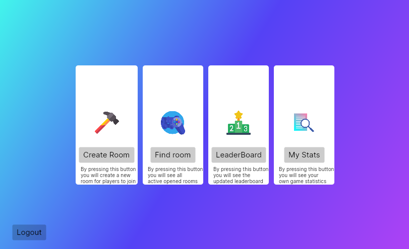

# Trivia Game GUI



This is the graphical user interface (GUI) for a trivia game server. It is built using **C#** and the **Avalonia** framework for cross-platform compatibility.

## Requirements

- .NET SDK
- Avalonia packages

## Building

Run the following commands to build the project:

```sh
dotnet build
dotnet run
```

## Features

- TCP socket based connection to the trivia game server
- Optional in-transit encryption
- Question and score state management
- Simple and responsive UI

## License

[MIT](LICENSE)
